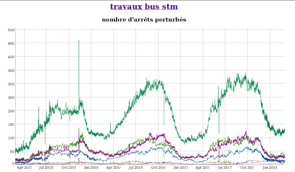
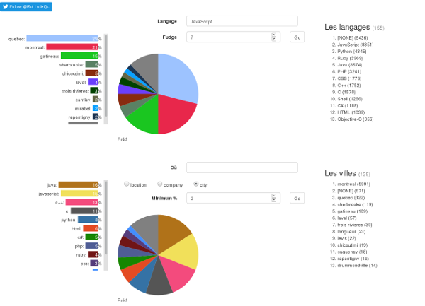

# *Hacker*
## Patenteux
> Jeune programmeur touche-à-tout depuis les années '80.

> * <http://robin.millette.info/>
> * <mailto:robin@millette.info>
> * <http://github.com/millette>
> * <http://twitter.com/rollodeqc>

## Membre co-fondateur
FACIL
  : <https://facil.qc.ca/>

Civic Access
  : <https://civicaccess.ca/mailman/listinfo/civicaccess-discuss>

## Intérêts
> * Logiciel libre
> * Données ouvertes
> * Programmation
> * Collecte de données

# Projets
## Perturbations autobus STM
<http://stm.waglo.com/>

------

## Urgences
Urgence dans les hopitaux du Québec

<https://urg-web-millette.hashbase.io/>

## Informatique au Québec
Les programmeurs

> * <http://lab.rollodeqc.com/>
> * <https://streaker.rollodeqc.com/today>

------

# Coffre à outils
## L'univers dat
Partage d'archives P2P

> * <https://univers-dat-millette.hashbase.io/univers-dat.html>
> * <https://datproject.org/>
> * <https://beakerbrowser.com/>

## Vega et Vega-lite
Visualisation de données

<https://vega.github.io/>

# Conclusion
## Des questions?

## Plus d'info
> * <http://robin.millette.info/>
> * <mailto:robin@millette.info>
> * <http://stm.waglo.com/>
> * <https://univers-dat-millette.hashbase.io/univers-dat.html>
> * <https://datproject.org/>
> * <https://beakerbrowser.com/>
> * <https://vega.github.io/>

---
title: Projets personnels
date: Samedi le 3 mars 2018
author: Robin Millette
lang: fr
autoslide: 0
theme: moon
...

